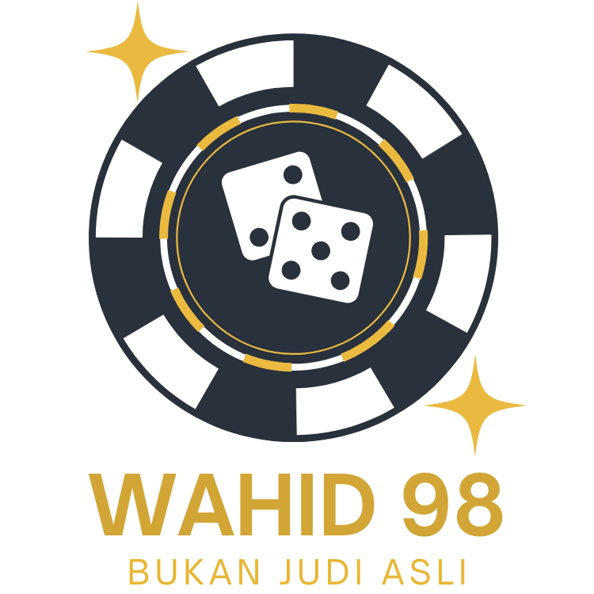

## Motivasi

Proyek ini adalah simulasi edukatif dari antarmuka kasino online. Semua taruhan dan hadiah di sini bersifat palsu — tidak ada uang nyata yang terlibat. Tujuan utama adalah memberikan pengalaman bermain yang intuitif sambil menjelaskan risiko dan mekanika matematis (seperti probabilitas dan ekspektasi) di balik permainan kasino.

## Fitur Utama

- Simulasi beberapa permainan (Slots, Roulette, Blackjack) dengan UI bertema kasino.
- Informasi probabilitas dan hadiah ditampilkan secara ringkas untuk tujuan edukasi.
- Saldo pemain disimpan di `localStorage` sehingga dapat dicoba ulang.
- Mekanika permainan dapat disesuaikan oleh pengembang (payouts, simbol, dsb.) untuk eksperimen.

## Menjalankan Proyek (Pengembangan)

1. Install dependensi dan siapkan Husky (untuk git hooks):

```powershell
npm i
npm run prepare
```

2. Jalankan mode development:

```powershell
npm run dev
```

3. Buka browser ke alamat yang tertera oleh Vite (biasanya `http://localhost:5173`).

Catatan: jika port sudah dipakai, Vite akan memilih port lain otomatis.

## Skrip yang Tersedia

- `npm run dev` — jalankan server development (Vite).
- `npm run build` — buat bundle produksi (jika diperlukan).
- `npm run test` — jalankan unit test (Vitest).
- `npm run coverage` — kumpulkan laporan cakupan test.

## Mengatur/Mengambil Saldo Demo (points)

Saldo permainan disimpan di `localStorage` pada kunci `points`. Untuk mengubah atau melihatnya secara manual:

1. Buka DevTools di browser (F12).
2. Pilih tab `Application` → `Local Storage` → pilih origin (mis. `http://localhost:5173`).
3. Edit nilai pada kunci `points` (nilai numerik, tanpa pemisah ribuan).

Atau pakai tombol/fitur dalam UI jika tersedia pada versi aplikasi.

## Catatan Edukatif & Tanggung Jawab

Proyek ini dibuat untuk tujuan pembelajaran saja. Perjudian nyata membawa risiko keuangan dan sosial. Informasi probabilitas dan EV yang ditampilkan bertujuan untuk edukasi — bukan untuk mendorong perjudian sungguhan. Jika Anda mengalami masalah terkait perjudian, cari bantuan profesional.

## Pengembangan & Kontribusi

- Struktur utama ada di folder `src/`:
	- `src/views/` — halaman permainan dan tampilan utama
	- `src/components/` — komponen UI (slot, roulette, dll.)
	- `src/assets/` — gaya dan aset statis

- Untuk kontribusi: fork repo, buat branch fitur, buat PR dan ikuti pedoman coding/style di repo.

## Lisensi

Proyek ini dilisensikan di bawah lisensi pada file `LICENSE` (lihat file tersebut untuk detail).

